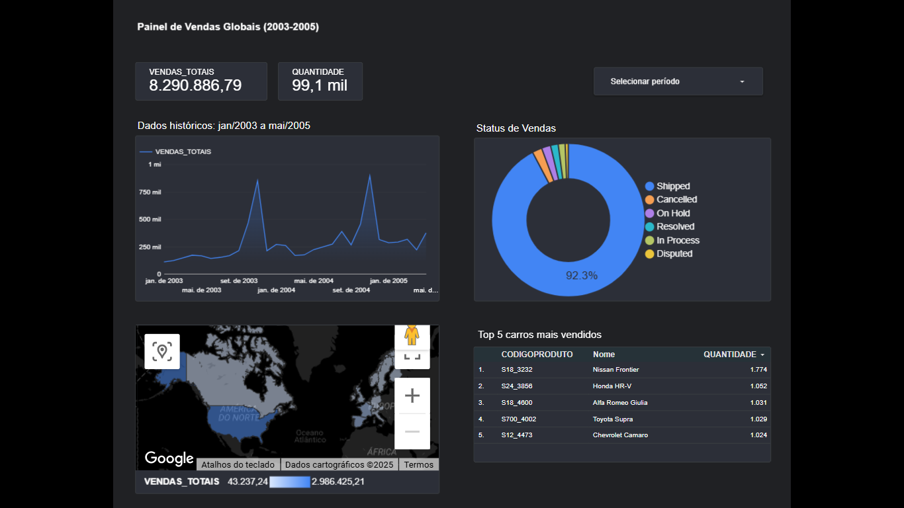

# Painel de Vendas Globais (2003-2005)

Este projeto apresenta um dashboard interativo criado no **Looker Studio**, com o objetivo de visualizar as vendas globais de veículos entre janeiro de 2003 e maio de 2005.

## 🔍 Descrição
O painel mostra:
- Vendas totais em valor e quantidade.
- Evolução das vendas ao longo do tempo.
- Status das vendas (Shipped, Cancelled, etc).
- Distribuição geográfica das vendas.
- Top 5 carros mais vendidos no período.

## 🛠️ Ferramentas
- Looker Studio (Google Data Studio)

## 📈 Visão do Dashboard

## 📈 Principais Insights
- O modelo mais vendido foi o **Nissan Frontier**, com 1.774 unidades.
- Mais de 92% dos pedidos foram efetivamente enviados.
- Os maiores picos de vendas ocorreram no final de 2003 e meados de 2004.

## 📎 Link para o dashboard
[https://lookerstudio.google.com/reporting/2d123cc7-1bfe-4698-9ac6-0e8a5567e7a7]

